Haladó R óra
================
Rácz, Péter
2024-11-05

# Sillabusz

1.  lineáris regresszió

- elmélet
  - jel és zaj, inferencia és jóslás
  - ki négyzet próba, t próba, anova, akármi: helyett hierarchikus
    általánosított lineáris modellek
  - mi lesz: lineáris modell, többértékű ~, általánosított ~,
    hierarchikus ~, modellválasztás, modellkritika, jóslás, ábrázolás,
    munkafolyamatok
  - mi nem lesz: matek, p értékek, más módszerek, alap programozás
  - együtthatók
  - maradékok
  - metszéspont és meredekség
  - faktorok
- gyakorlat:
  - `read_delim`
  - `ggplot`
  - `geom_smooth(method = 'lm')`
  - `lm()`
- házi
  - Datacamp::Introduction_to_Regression::Chapter_1

2.  jóslás

- elmélet:
  - predikció és extrapoláció
- gyakorlat
  - `summary()`
  - `glance()`
  - `predict()`
- házi
  - Datacamp::Introduction_to_Regression::Chapter_2

3.  diagnosztika

- elmélet:
  - r^2 és RSE
  - AIC és BIC
  - linearitás, homoszkedaszticitás, invariancia, a hibák függetlensége
  - Ascombe’s quartet
- gyakorlat:
  - `performance::model_performance()`
- házi:
  - Datacamp::Introduction_to_Regression::Chapter_3

4.  logisztikus regresszió

- elmélet:
  - általánosított lineáris modellek
  - véletlen komponens, kapcsolati függvény
  - p, oddszok, log oddsz
- gyakorlat:
  - `glm()`
  - `qlogis(), plogis(), exp()`
- házi:
  - Datacamp::Introduction_to_Regression::Chapter_4

5.  többszörös lineáris regresszió: numer + faktor

- elmélet:
  - alul- és túlillesztés
    - szabadságfok  
  - több metszéspont
- gyakorlat:
  - `1 + a`, `0 + a`
  - `performance::compare_performance()`
  - `anova()`
- házi:
  - Datacamp::Intermediate_Regression::Chapter_1

6.  többszörös lineáris regresszió: numer \* faktor

- elmélet:
  - több meredekség
  - Simpson paradoxona
  - interakciók
- gyakorlat:
  - `a*b`, `a:b`
- házi:
  - Datacamp::Intermediate_Regression::Chapter_2

7.  többszörös lineáris regresszió: numer \* numer

- elmélet:
  - többfokú meredekség
- gyakorlat:
- `geom_density`, `facet_wrap`
- házi:
  - Datacamp::Intermediate_Regression::Chapter_3

8.  többszörös logisztikus regresszió

- elmélet:
  - interakciók, kumulatív oddszok
- gyakorlat:
  - `sec.axis`
- házi:
  - Datacamp::Intermediate_Regression::Chapter_4

9.  hierarchikus általánosított lineáris modellek: random metszéspontok

- elmélet:
- gyakorlat:
- résztvevőszintű adatok és megfigyelésszintű adatok
- lme4()
- broom.mixed
- residual r^2, conditional r^2
- házi:
  - Datacamp::Hierarchical_Regression::Chapter_1

10. hierarchikus általánosított lineáris modellek: random meredekségek

- elmélet:
  - random meredekségek
- gyakorlat:
  - `(1|a)`, `(1 + b|a)`
- házi:
  - Datacamp::Hierarchical_Regression::Chapter_2

11. hierarchikus általánosított lineáris modellek: ismételt mérések

- elmélet:
  - anova, manova, paired t teszt
- gyakorlat:
  - `(1|item)`, `(1|participant)`
- házi:
  - Datacamp::Hierarchical_Regression::Chapter_4

# Hasznos linkek

[itt.](https://peterracz.wordpress.com/teaching/intro-r-bevezetes-az-r-programozasba/)

# Acknowledgement

This class is supported by DataCamp, the most intuitive learning
platform for data science and analytics. Learn any time, anywhere and
become an expert in R, Python, SQL, and more. DataCamp’s learn-by-doing
methodology combines short expert videos and hands-on-the-keyboard
exercises to help learners retain knowledge. DataCamp offers 350+
courses by expert instructors on topics such as importing data, data
visualization, and machine learning. They’re constantly expanding their
curriculum to keep up with the latest technology trends and to provide
the best learning experience for all skill levels. Join over 6 million
learners around the world and close your skills gap.

# Kisokos

Az órán tanultak, egy helyen.

## 0. Milyen package-ekre (library-kre) lesz szükségünk?

``` r
library(tidyverse) # tidyverse csomagok, select/filter/arrange/mutate/summarise, ggplot
library(broom.mixed) # tidy, glance, augment
library(performance) # modellösszehasonlítgatás
library(sjPlot) # modell becsléseinek ábrázolása
library(lme4) # hierarchikus / kevert lineáris modellek
library(glmmTMB) # sjplotnak kell
```

## 1. Ábrázolás, feltérképezés (exploratory data analysis)

Az R beépített adathalmazai közül egyet, az iris-t fogjuk használni. Az
iris méréseket tartalmaz virágfajtákról, amelyeknek három alfaja van, és
négy dimenziójukat mérjük: a virág szirmának hosszát és szélességét,
valamint a csészelevelek hosszát és szélességét. Az iris adathalmazt az
idők hajnala óta használják arra, hogy gépi tanulást meg kategorizációt
tanítsanak rá, mivel a fajták könnyen megkülönböztethetőek a méreteik
alapján. Mi most lineáris modelleket fogunk rá építeni, mert erre a
célra is tökéletesen megfelel.

``` r
str(iris)
```

    ## 'data.frame':    150 obs. of  5 variables:
    ##  $ Sepal.Length: num  5.1 4.9 4.7 4.6 5 5.4 4.6 5 4.4 4.9 ...
    ##  $ Sepal.Width : num  3.5 3 3.2 3.1 3.6 3.9 3.4 3.4 2.9 3.1 ...
    ##  $ Petal.Length: num  1.4 1.4 1.3 1.5 1.4 1.7 1.4 1.5 1.4 1.5 ...
    ##  $ Petal.Width : num  0.2 0.2 0.2 0.2 0.2 0.4 0.3 0.2 0.2 0.1 ...
    ##  $ Species     : Factor w/ 3 levels "setosa","versicolor",..: 1 1 1 1 1 1 1 1 1 1 ...

``` r
head(iris)
```

    ##   Sepal.Length Sepal.Width Petal.Length Petal.Width Species
    ## 1          5.1         3.5          1.4         0.2  setosa
    ## 2          4.9         3.0          1.4         0.2  setosa
    ## 3          4.7         3.2          1.3         0.2  setosa
    ## 4          4.6         3.1          1.5         0.2  setosa
    ## 5          5.0         3.6          1.4         0.2  setosa
    ## 6          5.4         3.9          1.7         0.4  setosa

Nézzük meg, hogyan viszonyulnak egymáshoz a különféle méretek.

``` r
# sepal length x width x species
ggplot(iris, aes(x = Sepal.Length, y = Sepal.Width, color = Species)) +
  geom_point() +
  geom_smooth(method = 'lm', se = FALSE) +
  theme_minimal()
```

    ## `geom_smooth()` using formula = 'y ~ x'

<!-- -->

``` r
# petal length x width x species
ggplot(iris, aes(x = Petal.Length, y = Petal.Width, color = Species)) +
  geom_point() +
  geom_smooth(method = 'lm', se = FALSE) +
  theme_minimal()
```

    ## `geom_smooth()` using formula = 'y ~ x'

<!-- -->

``` r
# petal length x sepal length x species
ggplot(iris, aes(x = Petal.Length, y = Sepal.Length, color = Species)) +
  geom_point() +
  geom_smooth(method = 'lm', se = FALSE) +
  theme_minimal()
```

    ## `geom_smooth()` using formula = 'y ~ x'

<!-- -->

``` r
# petal width x sepal width x species
ggplot(iris, aes(x = Petal.Width, y = Sepal.Width, color = Species)) +
  geom_point() +
  geom_smooth(method = 'lm', se = FALSE) +
  theme_minimal()
```

    ## `geom_smooth()` using formula = 'y ~ x'

<!-- -->

A szirom (sepal) hossza összefügg a szélességével, a fellevél (petal)
hossza is összefügg a szélességével, és a szirom és a fellevél hossza
illetve szélessége is összefügg. De a szirom és a fellevél is nagyon más
alakú attól függően, hogy milyen fajról beszélünk, ezért enélkül az
információ nélkül nem tudjuk jól modellezni őket.

------------------------------------------------------------------------

Több tidyverse [itt](https://www.tidyverse.org/). Több ggplot2
[itt](https://ggplot2.tidyverse.org/).

------------------------------------------------------------------------

## 2. Modellépítés

### 2.1. Lineáris modell

Most főleg a sepal width-et fogjuk jósolgatni a petal width-ből.

Szintaxis:

``` r
# sima lineáris modell: y = a + b * x
lm1 <- lm(Sepal.Width ~ Petal.Width, data = iris)
# többváltozós lineáris modell: faktor és numerikus prediktor: y = a1 / a2 / a3 + b * x
lm2 <- lm(Sepal.Width ~ Species + Petal.Width, data = iris)
# interakció: faktor és numerikus prediktor: y = a1 + b1 * x / a2 + b2 * x / a3 + b3 * x
lm3 <- lm(Sepal.Width ~ Species * Petal.Width, data = iris)
# interakció: két numerikus prediktor:
lm4 <- lm(Sepal.Width ~ Sepal.Length * Petal.Length, data = iris)
# persze egy lineáris modellben lehet akárhány prediktor:
lm5 <- lm(Sepal.Width ~ Petal.Width + Petal.Length + Sepal.Length + Species, data = iris)
```

### 2.2 Hierachikus lineáris modell

Szintaxis:

``` r
# grouping faktor / random intercept:
lmm1 <- lmer(Sepal.Width ~ Petal.Width + (1 | Species), data = iris)
# grouping faktor és saját slope / random intercept és random slope:
lmm2 <- lmer(Sepal.Width ~ Petal.Width + (1 + Petal.Width | Species), data = iris)
```

### 2.3. Generalizált lineáris modell

Szintaxis:

``` r
# bináris válaszváltozó: binominalis eloszlás, logit linkfüggvény
iris$setosa = ifelse(iris$Species == "setosa", 1, 0)

glm1 <- glm(setosa ~ Sepal.Length, data = iris, family = binomial(link = "logit"))

# persze ez is lehet hierarchikus modell

glmm1 <- glmer(setosa ~ Sepal.Length + (1 | Species), data = iris, family = binomial(link = "logit"))
```

------------------------------------------------------------------------

Több lme4
[itt](https://cran.r-project.org/web/packages/lme4/index.html).

------------------------------------------------------------------------

## 3. Modellkritika

Öt modellt fogunk megnézni részletesebben. Ezek az lm1-3 és az lmm1-2.
Emlékeztetőül:

``` r
formula(lm1)
```

    ## Sepal.Width ~ Petal.Width

``` r
formula(lm2)
```

    ## Sepal.Width ~ Species + Petal.Width

``` r
formula(lm3)
```

    ## Sepal.Width ~ Species * Petal.Width

``` r
formula(lmm1)
```

    ## Sepal.Width ~ Petal.Width + (1 | Species)

``` r
formula(lmm2)
```

    ## Sepal.Width ~ Petal.Width + (1 + Petal.Width | Species)

Megfeleltek a modellek a regresszió alapvetéseinek?

#### lm1

``` r
check_model(lm1)
```

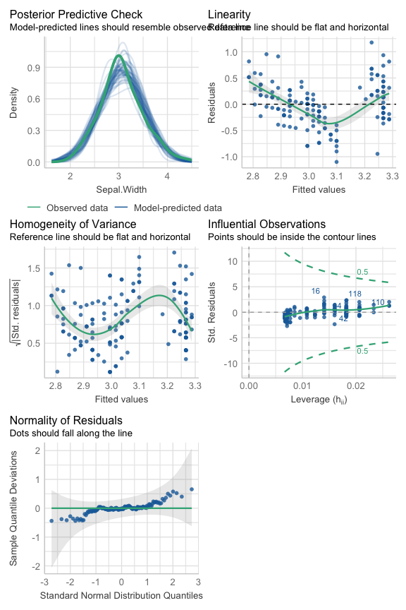<!-- -->

Az első modellban maradékok eloszlása nagyjából normális, de a variancia
nem konstans, szemmel láthatóan van még valami struktúra az adatokban,
amit ez a modell nem talál meg.

#### lm2

``` r
check_model(lm2)
```

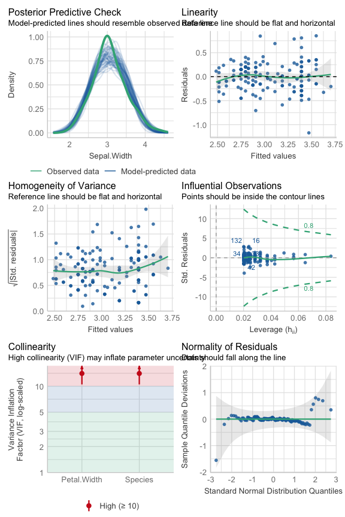<!-- -->

A második modellban megengedtük azt, hogy a lineáris modellnek a három
fajra különböző interceptje legyen, de azt nem, hogy a slope is
különböző legyen. A maradékok eloszlása és a variancia is javult, de nem
tökéletes. A prediktorok közötti kollinearitás viszont elég súlyos: a
három virágfajta méretei drasztikusan különböznek, ezért a species elég
jól megragadja a petal width-et, azaz aggályos őket ugyanabban a
modellban használni.

Vesd össze:

``` r
clm = lm(Sepal.Width ~ Species, data = iris)
tidy(clm) %>% 
  knitr::kable('simple', digits = 2)
```

| term              | estimate | std.error | statistic | p.value |
|:------------------|---------:|----------:|----------:|--------:|
| (Intercept)       |     3.43 |      0.05 |     71.36 |       0 |
| Speciesversicolor |    -0.66 |      0.07 |     -9.69 |       0 |
| Speciesvirginica  |    -0.45 |      0.07 |     -6.68 |       0 |

#### lm3

``` r
check_model(lm3)
```

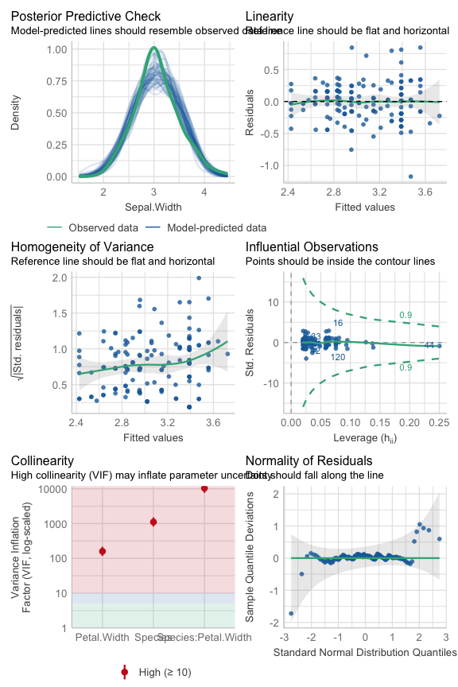<!-- -->

A harmadik modellban megengedtük azt, hogy külön intercept és slope
legyen a három fajra. Ez megoldja a maradékok eloszlásának a problémáit,
viszont itt már gigantikus bajunk lesz azzal, hogy a két prediktor
nagyon durván kollineáris (az interakció két olyan dolgot “szoroz
össze”, amik már eleve ugyanazt mérik, tehát gáz van).

#### lmm1

``` r
check_model(lmm1)
```

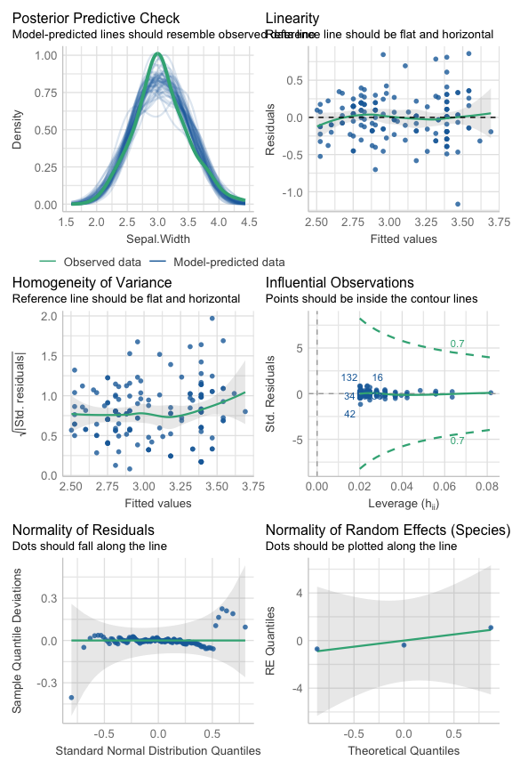<!-- -->

Az az alapvető baj, hogy minket a species hatása igazából most nem
érdekel. Minket az érdekel, hogy ebben a virágtípusban a szirom hossza
megjósolja-e a szirom szélességét. Viszont a species fontos eleme az
adatok hierarchiájának: a különböző fajták eleve eltérő méretűek. Ezért
a negyedik modellban betesszük a species-t grouping faktornak. Az
eredmény hasonló az lm2-höz, a maradékok eloszlása és a variancia is jó,
de nem tökéletes. A kollinearitással most nincsen córesz, mivel a
species nem prediktor, hanem grouping factor.

#### lmm2

``` r
check_model(lmm2)
```

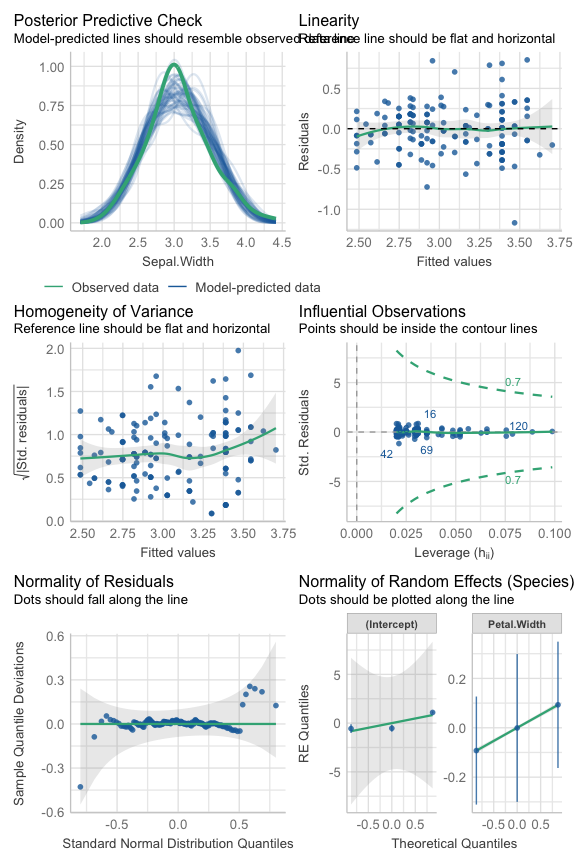<!-- -->

Az ötödik modellban megengedjük, hogy a slope a grouping factor által
meghatározott csoportokban különböző legyen. Így már elég szépek a
maradékok. Ami azt illeti, olyan nagy javulás nem látszik az
intercept-only modellhez képest. Itt sem kell kollinearitás miatt
aggódnunk, mert a species nem fixed effect, hanem grouping factor.

**Melyik modell a jobb?**

Tudjuk, hogy az lm1 eleve aggályos, mert hülyén néznek ki a maradékok,
az lm2 és az lm3 pedig konkrétan teljesen vállalhatatlanok, mert olyan
kollineáris a két prediktor, hogy valószínűleg értelmezhetetlenek az
estimate-ek: a modell hősiesen kiszámolt valamit, de amit kiszámolt,
annak kevés köze van a valósághoz. Az interakcióról nem is beszélve.
Hasonlítsuk össze az lm1-lmm1-lmm2-t.

``` r
compare_performance(lm1, lmm1, lmm2) %>% 
  knitr::kable('simple', digits = 2)
```

| Name | Model | AIC | AIC_wt | AICc | AICc_wt | BIC | BIC_wt | RMSE | Sigma | R2_conditional | R2_marginal | ICC | R2 | R2_adjusted |
|:---|:---|---:|---:|---:|---:|---:|---:|---:|---:|---:|---:|---:|---:|---:|
| lm1 | lm | 159.96 | 0.00 | 160.13 | 0.00 | 169.00 | 0.00 | 0.4 | 0.41 | NA | NA | NA | 0.13 | 0.13 |
| lmm1 | lmerMod | 89.98 | 0.89 | 90.26 | 0.91 | 102.02 | 0.99 | 0.3 | 0.30 | 0.93 | 0.25 | 0.91 | NA | NA |
| lmm2 | lmerMod | 94.24 | 0.11 | 94.83 | 0.09 | 112.31 | 0.01 | 0.3 | 0.30 | 0.94 | 0.26 | 0.91 | NA | NA |

``` r
plot(compare_performance(lm1, lmm1, lmm2))
```

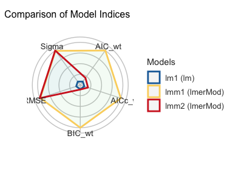<!-- -->

Úgy tűnik, hogy az lmm1 a legjobb modell. Őt nem csak ez az ábra
indokolja, hanem az is, hogy tudjuk, hogy az lm1-ben hülyén néznek ki a
maradékok, és azt is tudjuk, hogy valószínűleg azért, mert a
megfigyeléseinket nagyban meghatározza, hogy a mérések melyik
virágfajtához tartoznak, és az lm1 erről nem vesz tudomást. Nagyon
hasonló módon érdemes rögtön hierarchikus / kevert modellel kezdeni, ha
az adatok hierarchikussága egyértemű: pl egy kísérletben több válasz
tartozik egy-egy emberhez, vagy egy felmérésben több ember pontszáma
egy-egy iskolához, stb.

Biztonság kedvéért hasonlítsuk össze csupán a két hierarchikus modellt
egymással.

``` r
compare_performance(lmm1, lmm2) %>% 
  knitr::kable('simple', digits = 2)
```

    ## Some of the nested models seem to be identical and probably only vary in
    ##   their random effects.

| Name | Model | AIC | AIC_wt | AICc | AICc_wt | BIC | BIC_wt | R2_conditional | R2_marginal | ICC | RMSE | Sigma |
|:---|:---|---:|---:|---:|---:|---:|---:|---:|---:|---:|---:|---:|
| lmm1 | lmerMod | 89.98 | 0.89 | 90.26 | 0.91 | 102.02 | 0.99 | 0.93 | 0.25 | 0.91 | 0.3 | 0.3 |
| lmm2 | lmerMod | 94.24 | 0.11 | 94.83 | 0.09 | 112.31 | 0.01 | 0.94 | 0.26 | 0.91 | 0.3 | 0.3 |

``` r
plot(compare_performance(lmm1, lmm2))
```

    ## Some of the nested models seem to be identical and probably only vary in
    ##   their random effects.

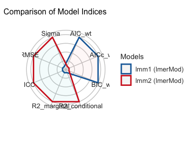<!-- -->

A két hierarchikus (kevert) modell közül is az lmm1 tűnik jobbnak, főleg
azoknak a mérőszámoknak az alapján, amelyke a komplexitást büntetik
(AIC, BIC). Csináljunk egy likelihood ratio tesztet, ami megmondja, hogy
melyik modell illeszkedik jobban az adatokra:

``` r
test_likelihoodratio(lmm1,lmm2) %>% 
  knitr::kable('simple', digits = 2)
```

    ## Some of the nested models seem to be identical and probably only vary in
    ##   their random effects.

|      | Name | Model   |  df | df_diff | Chi2 |    p |
|------|:-----|:--------|----:|--------:|-----:|-----:|
| lmm1 | lmm1 | lmerMod |   4 |      NA |   NA |   NA |
| lmm2 | lmm2 | lmerMod |   6 |       2 | 0.34 | 0.84 |

A p-value 0.05 fölött van, tehát a lmm2 nem illeszkedik szignifikánsan
jobban az adatokra, mint a lmm1. A BIC és az AIC is kisebb az lmm1
esetén, tehát ez elég egyértelmű.

Vesd össze: ugyanez a teszt azt mondja, hogy az lmm1 jobb, mint az lm1,
hiába sokkal bonyibb.

``` r
test_likelihoodratio(lm1,lmm1) %>% 
  knitr::kable('simple', digits = 2)
```

|      | Name | Model   |  df | df_diff |  Chi2 |   p |
|------|:-----|:--------|----:|--------:|------:|----:|
| lm1  | lm1  | lm      |   3 |      NA |    NA |  NA |
| lmm1 | lmm1 | lmerMod |   4 |       1 | 71.98 |   0 |

------------------------------------------------------------------------

Több modellkritika [itt](https://easystats.github.io/performance/).

------------------------------------------------------------------------

## 4. Modell értelmezése, vizualizáció

``` r
summary(lmm1)
```

    ## Linear mixed model fit by REML ['lmerMod']
    ## Formula: Sepal.Width ~ Petal.Width + (1 | Species)
    ##    Data: iris
    ## 
    ## REML criterion at convergence: 83.7
    ## 
    ## Scaled residuals: 
    ##     Min      1Q  Median      3Q     Max 
    ## -3.8786 -0.6281  0.0294  0.6323  2.8523 
    ## 
    ## Random effects:
    ##  Groups   Name        Variance Std.Dev.
    ##  Species  (Intercept) 0.92709  0.9629  
    ##  Residual             0.09047  0.3008  
    ## Number of obs: 150, groups:  Species, 3
    ## 
    ## Fixed effects:
    ##             Estimate Std. Error t value
    ## (Intercept)   2.1524     0.5747   3.745
    ## Petal.Width   0.7546     0.1197   6.303
    ## 
    ## Correlation of Fixed Effects:
    ##             (Intr)
    ## Petal.Width -0.250

A summary függvény kiirogatja az R konzolba a modell fő paramétereit. Ez
jó, csak nehéz berakni mondjuk egy táblázatba.

A tidy függvény kevesebb információt közöl, de takarosabb.

``` r
tidy(lmm1, conf.int = T) %>% 
  knitr::kable('simple', digits = 2)
```

| effect | group | term | estimate | std.error | statistic | conf.low | conf.high |
|:---|:---|:---|---:|---:|---:|---:|---:|
| fixed | NA | (Intercept) | 2.15 | 0.57 | 3.75 | 1.03 | 3.28 |
| fixed | NA | Petal.Width | 0.75 | 0.12 | 6.30 | 0.52 | 0.99 |
| ran_pars | Species | sd\_\_(Intercept) | 0.96 | NA | NA | NA | NA |
| ran_pars | Residual | sd\_\_Observation | 0.30 | NA | NA | NA | NA |

Ábrázoljuk a modell becsléseit.

``` r
plot_model(lmm1, 'est')
```

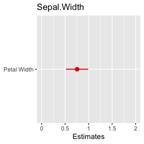<!-- -->

Hát itt egy “b” van, a petal width, szóval ez nem túl érdekes. Nézzünk
meg egy modellt, amiben sok van.

``` r
plot_model(lm5, 'est')
```

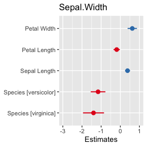<!-- -->

Vigyázat: ha a különféle prediktorok nem ugyanazon a skálán vannak,
akkor ez jó hülyén fog kinézni. Itt ez egyszerűen eleve adott (mindegyik
valami méret), illetve a scale() függvény segítségével is átalakíthatunk
prediktorokat (`pred = scale(pred)`).

Ábrázoljuk a modell predikcióit.

``` r
plot_model(lmm1, 'pred')
```

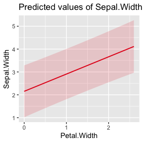<!-- -->

Predikciók ábrázolása több prediktor esetén. A `plot_model` mindig a
kimeneti változóra tett jóslatot teszi az y tengelyre, az első megadott
term-et (prediktort) teszi az x tengelyre, és a többi megadott term
szerint bont. Ha a második (harmadik) term egy folyamatos változó, akkor
csinál belőle három bödönt, és ábrázolja azokat. (Itt valszeg *mind a
két példának használt modell teljesen értelmetlen jóslatokat tesz*, de
arra jók, hogy gyakoroljuk ezeket a függvényeket.)

``` r
plot_model(lm3, 'pred', terms = c('Petal.Width','Species'))
```

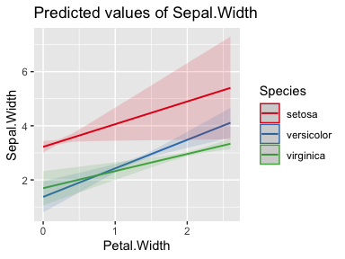<!-- -->

``` r
plot_model(lm3, 'pred', terms = c('Species','Petal.Width'))
```

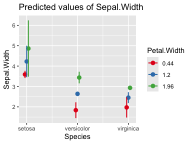<!-- -->

``` r
plot_model(lm4, 'pred', terms = c('Petal.Length','Sepal.Length'))
```

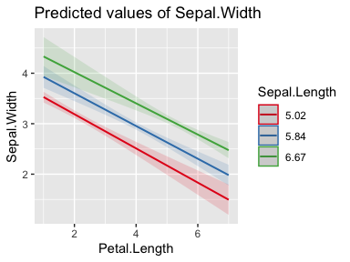<!-- -->

``` r
plot_model(lm4, 'pred', terms = c('Sepal.Length','Petal.Length'))
```

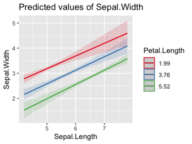<!-- -->

Hierarchikus / kevert modellek esetén ábrázolhatjuk a random
intercepeket és slope-okat is.

``` r
plot_model(lmm1, 're')
```

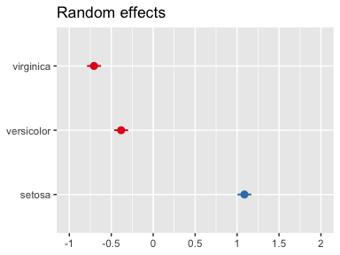<!-- -->

``` r
plot_model(lmm2, 're')
```

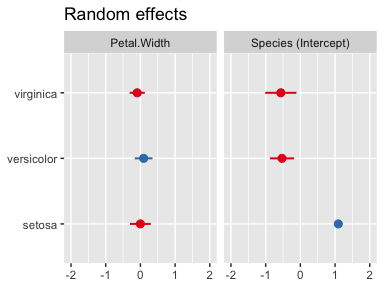<!-- -->

------------------------------------------------------------------------

Több sjplot [itt](https://strengejacke.github.io/).

------------------------------------------------------------------------
